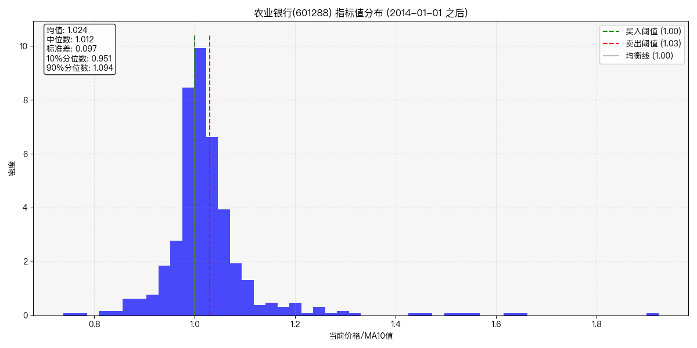
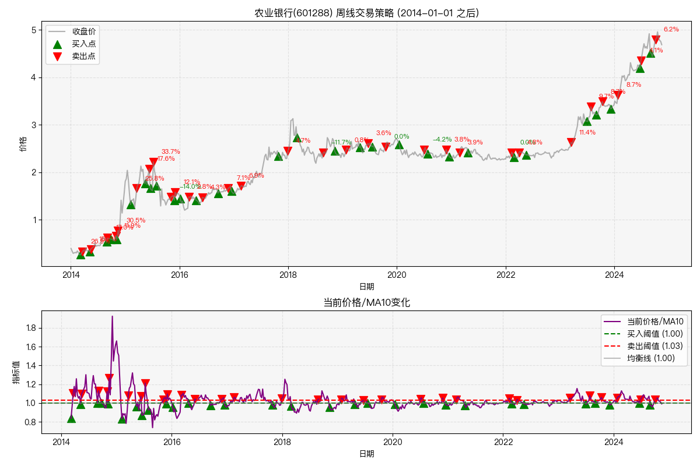

# A股国有银行股票猎手

## 项目简介

专注于中国国有银行（工、农、中、建、交）投资机会的分析工具，寻找低风险且稳定的回报。

## 思路来源

来源于“坚持不上补习班”的微信公众号文章《投资系列4-选股和我的个人交易体系》中的稳定收益部分。作者聚焦于中国A股市场中的银行股票，认为这是一个低风险且稳定的投资机会。理由主要如下：
- 银行股有稳定的股息分红。部分银行股的股息率高于银行存款利率，可达4%以上。
- 银行股的股价波动较小，适合按照月线周线顶底买卖做差价获得稳定收益。

在查阅了银行股资料和过去1-2年的银行股历史数据后，[我定性认同了作者的观点](./docs/定性分析.md)。我想定量地验证这一观点，根据历史数据来寻找低风险且稳定的回报，且希望通过数据分析来寻找未来的投资时机。

## 开发环境
这是一个Python 3.8项目，使用了以下库：
- akshare >= 1.15， 用于获取股价数据
- matplotlib >= 3.7， 用于可视化
- numpy， 用于数学计算
- pandas， 用于数据处理

这些库通常可以通过`pip`或`conda`安装。

## 文件介绍
- docs文件夹：存放项目文档
- resource文件夹：存放图片和股价数据
- stock_data_downloader.py：下载股价数据
- stock_data: 读取股价数据并调用其他模块进行数据处理
- stock_data_processor.py：处理股价数据，并计算各种指标
- chart.py：绘制股价图表

## 使用方法
安装好必要的依赖，运行`python main.py`文件即可。
### 简单的固定策略
我们使用周线，以当前价格/MA10为指标，首先计算出这一指标在2014年至今的分布情况。

设置买入点为当前价格/MA10小于等于0.99，卖出点为当前价格/MA10大于等于1.03策略的运行结果：

## 开发计划

|任务|描述|状态|
|---|-----|----|
|股价数据收集|收集银行股过去十年的股价数据|已完成|
|月线、周线、日线数据计算|计算每支银行股的月线、周线、日线数据|已完成|
|可视化|绘制每支银行股的月线、周线、日线数据|已完成|
|主要指标计算|计算每支银行股的MA5, MA10, MA20指标。不使用现有库|已完成|
|重构|将面向过程代码重构为面向对象|已完成|
|将strategy_analyzer中的代码拆分为两个文件|拆分不同策略的公用部分和每个策略单独的部分|已完成|
|历史指标统计|统计每支银行股的历史指标数据，选择合适的买卖时机|已完成|
|回测|支持回测历史数据，验证买卖时机的准确性|已完成|
|辅助指标计算|计算每支银行股的KDJ, MACD, ADX指标。不使用现有库|进行中|
｜策略优化|优化买卖策略，提高收益率|未开始|
