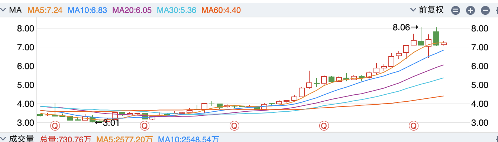

# A股国有银行股票猎手

## 项目简介

专注于中国国有银行（工、农、中、建、交）投资机会的分析工具，寻找低风险且稳定的回报。

## 思路来源

来源于“坚持不上补习班”的微信公众号文章《投资系列4-选股和我的个人交易体系》中的稳定收益部分。作者聚焦于中国A股市场中的银行股票，认为这是一个低风险且稳定的投资机会。理由主要如下：
- 银行股有稳定的股息分红。部分银行股的股息率高于银行存款利率，可达4%以上。
- 银行股的股价波动较小，适合按照月线周线顶底买卖做差价获得稳定收益。

在查阅了银行股资料和过去1-2年的银行股历史数据后，我定性认同了作者的观点。我想定量地验证这一观点，根据历史数据来寻找低风险且稳定的回报，且希望通过数据分析来寻找未来的投资时机。

## 定性分析

### 国有银行股的股息分红和价格情况

首先，我在同花顺上找到了A股上市的42支银行股。这些银行包括了国有大型商业银行、全国性股份制商业银行以及区域性商业银行。考虑到资金安全性，我选择国有大型银行作为实验样本。国有大型银行包括工商银行、建设银行、农业银行、中国银行、交通银行和邮储银行。在查看这些银行股过去两年的价格波动后，我排除了价格波动较大的邮储银行，并选择了前五家银行作为研究对象。

要查看公司的分红信息，最权威的是查看上市公司在证券交易所的公告。也可以通过同花顺等平台的分红配送栏目查看。
我选择在同花顺上查看这些银行股的分红信息。在“个股资料”里查看“分红融资”，可以看到最近一年的分红金额。在“分红方案说明“里查看分红金额和分红时间。

在11/08/2024，我查看了这些银行股的股价，计算了上一年的分红金额与当前股价的比值，以及当前股价在过去一年的周K线下的分位。
| 代码 | 名称 | 2023年每派分红金额 | 周K下最低/最高 | 现价 | 上一年分红金额/当前股价 | 现价在周K波动中的分位 |
| --- | --- | --- | --- | --- | --- | --- |
| 601398 | 工商银行 | 0.3064 | 4.25/6.66 | 6.11 | 5.0% | 77.1% |
| 601939 | 建设银行 | 0.4 | 5.78/8.66 | 8.0 | 5% | 77.2% |
| 601288 | 农业银行 | 0.2309 | 3.27/5.17 | 4.76 | 4.85% | 78.4% |
| 601988 | 中国银行 | 0.2364 | 3.55/5.40 | 4.86 | 4.86% | 70.8% |
| 601328 | 交通银行 | 0.375 | 5.17/8.06 | 7.22 | 5.2% | 70.9% |

### 通过技术面分析寻找买卖时机
在技术面上，我们以月线、周线和日线为主要参考，并从大到小地判断买卖时机。我们还可以使用KDA、MACD、ADX等指标来辅助判断。

可以根据当前价格和MA的关系来判断是否接近底部。以交通银行为例，我们可以在月线上计算每个点位价格和的MA的比例。如果我们以月为指标，可以计算当前价格/MA10来判断是在高位还是低位。

例如，当前价格为7.22，MA10为6.83，该比值为105.7%。上一个高位8月数值为111.8%，上一个低位1月的数值5.62/5.27 = 106.6%。我认为当前价格是合适的。

从周线级别来看，当前价格已到达MA5和MA20，但还没有突破MA10和MA30，还可以等待一段时间后再入场。当前KDA线接近卖点，ADX趋势值较弱，可以等到DI+和DI-非常接近的时候再入手。

从日线角度看，当前已过金叉较多但未到死叉，应该等到下一个金叉出现。可能过1个月左右是比较适合的入场时机。

## 开发计划

|任务|描述|状态|
|---|-----|----|
|股价数据收集|收集银行股过去十年的股价数据|已完成|
|月线、周线、日线数据计算|计算每支银行股的月线、周线、日线数据|进行中|
|可视化|绘制每支银行股的月线、周线、日线数据|未开始|
|主要指标计算|计算每支银行股的MA5, MA10, MA20指标。不使用现有库|未开始|
|辅助指标计算|计算每支银行股的KDJ, MACD, ADX指标。不使用现有库|未开始|
|历史指标统计|统计每支银行股的历史指标数据，选择合适的买卖时机|未开始|
|回测|回测历史数据，验证买卖时机的准确性|未开始|
