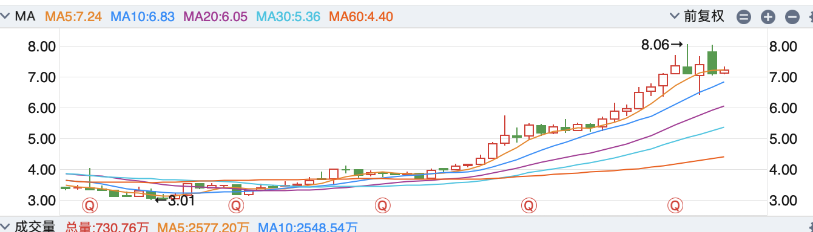

# China-State-Bank-Stock-Hunter

## Introduction

An analysis tool focused on China's state-owned banks (ICBC, ABC, BOC, CCB, BOCOM), seeking stable returns with low risk.

## Inspiration

Inspired by the "stable returns" section from the WeChat article "Investment Series 4 - Stock Selection and My Trading System" published by "坚持不上补习班". The author focuses on bank stocks in China's A-share market, considering them as low-risk and stable investment opportunities. The main reasons are:

- Bank stocks provide stable dividend yields. Some bank stocks offer dividend yields higher than bank deposit rates, reaching over 4%.
- Bank stocks have relatively low price volatility, suitable for trading based on monthly and weekly highs and lows to achieve stable returns.

After reviewing bank stock information and historical data from the past 1-2 years, I qualitatively agree with the author's viewpoint. I want to quantitatively verify this perspective, seeking low-risk and stable returns based on historical data, and aim to identify future investment opportunities through data analysis.

## Qualitative Analysis

### Dividend and Price Situation of State-Owned Banks

First, I found 42 bank stocks listed on China's A-share market using THS (Tonghuashun). These banks include state-owned commercial banks, national joint-stock commercial banks, and regional commercial banks. Considering capital security, I chose state-owned banks as my experimental sample. State-owned banks include Industrial and Commercial Bank of China (ICBC), China Construction Bank (CCB), Agricultural Bank of China (ABC), Bank of China (BOC), Bank of Communications (BOCOM), and Postal Savings Bank of China (PSBC). After reviewing the price movements of these bank stocks over the past two years, I excluded PSBC due to its high price volatility and selected the other five banks as research subjects.

To check dividend information, the most authoritative source is the company announcements on the stock exchange. This information can also be viewed through platforms like THS in their dividend distribution section.

I chose to check these banks' dividend information on THS. Under "Stock Information," in the "Dividends and Financing" section, you can see the dividend amount for the most recent year. The dividend amount and timing can be found in the "Dividend Plan Description."

On November 8, 2024, I checked these bank stocks' prices, calculated the ratio of last year's dividend to current price, and determined the current price's percentile within the past year's weekly K-line range.

| Code | Name | 2023 Dividend Per Share | Weekly K Min/Max | Current Price | Last Year Dividend/Current Price | Current Price Percentile |
|------|------|------------------------|------------------|---------------|--------------------------------|------------------------|
| 601398 | ICBC | 0.3064 | 4.25/6.66 | 6.11 | 5.0% | 77.1% |
| 601939 | CCB | 0.4 | 5.78/8.66 | 8.0 | 5% | 77.2% |
| 601288 | ABC | 0.2309 | 3.27/5.17 | 4.76 | 4.85% | 78.4% |
| 601988 | BOC | 0.2364 | 3.55/5.40 | 4.86 | 4.86% | 70.8% |
| 601328 | BOCOM | 0.375 | 5.17/8.06 | 7.22 | 5.2% | 70.9% |
### Find Buy and Sell Opportunities Through Technical Analysis

In technical analysis, we primarily refer to monthly, weekly, and daily charts, and assess trading opportunities from a macro to micro perspective. We can also use indicators like KDJ, MACD, and ADX for supplementary analysis.

We can determine if the price is near the bottom based on the relationship between current price and MA (Moving Average). Taking Bank of Communications as an example, we can calculate the ratio between price and MA at each point on the monthly chart. Using monthly indicators, we can calculate current price/MA10 to judge whether the price is high or low.

For example, the current price is 7.22, and MA10 is 6.83, giving a ratio of 105.7%. The previous high in August was 111.8%, and the previous low in January was 5.62/5.27 = 106.6%. I consider the current price appropriate.

From a weekly perspective, the current price has reached MA5 and MA20 but hasn't broken through MA10 and MA30, suggesting we could wait longer before entering. Currently, the KDJ line is approaching a sell signal, and the ADX trend is weak. It might be better to wait until DI+ and DI- are very close before entering.

From a daily chart perspective, while we've seen several golden crosses but no death cross yet, it's advisable to wait for the next golden cross. A suitable entry point might be in about a month.